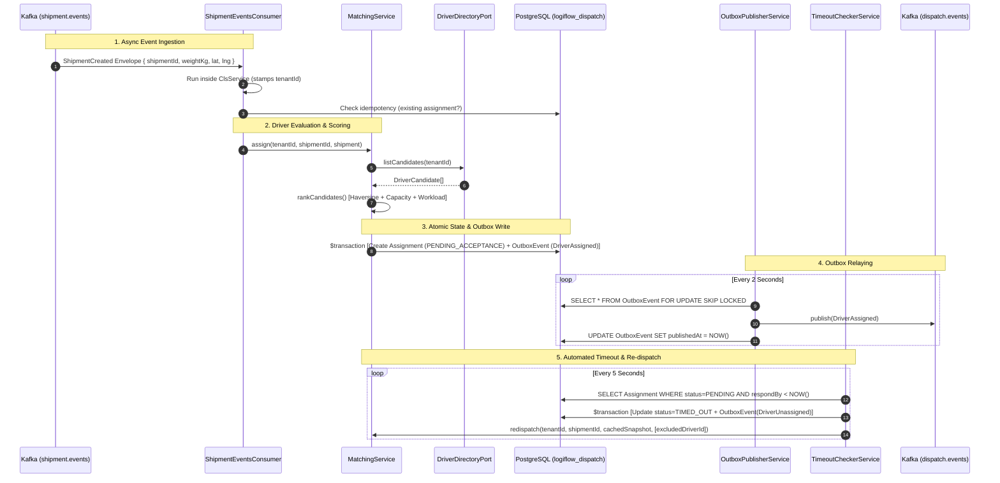

# 🚚 LogiFlow Dispatch Service: Architectural & Technical Deep Dive

---

## 📑 Table of Contents
1. [Executive Summary & Core Responsibility](#1-executive-summary--core-responsibility)
2. [End-to-End Workflow & Architecture Diagram](#2-end-to-end-workflow--architecture-diagram)
3. [Deep Dive: Apache Kafka in LogiFlow](#3-deep-dive-apache-kafka-in-logiflow)
   - [Event-Driven Topology & Topics](#event-driven-topology--topics)
   - [Transactional Outbox Pattern](#transactional-outbox-pattern)
   - [At-Least-Once Delivery & Idempotency](#at-least-once-delivery--idempotency)
   - [What is `__consumer_offsets` in Kafka & Kafka UI?](#what-is-__consumer_offsets-in-kafka--kafka-ui)
4. [File-by-File Technical Breakdown](#4-file-by-file-technical-breakdown)
   - [Database & Schema](#database--schema)
   - [Entrypoint & Root Module](#entrypoint--root-module)
   - [Prisma & Multi-Tenant Scoping](#prisma--multi-tenant-scoping)
   - [Driver Directory Layer (Port & Adapter)](#driver-directory-layer-port--adapter)
   - [Matching Engine & Scoring Algorithm](#matching-engine--scoring-algorithm)
   - [Kafka Consumer Layer](#kafka-consumer-layer)
   - [Assignments & Lifecycle Management](#assignments--lifecycle-management)
   - [Transactional Outbox Publisher](#transactional-outbox-publisher)
5. [Summary Table of File Roles](#5-summary-table-of-file-roles)

---

## 1. Executive Summary & Core Responsibility

The **Dispatch Service** is the automated matching and orchestration brain of the LogiFlow logistics platform. It is responsible for:
* Listening asynchronously for new shipments (`ShipmentCreated`).
* Evaluating available driver candidates based on hard constraints (capacity, status).
* Scoring and ranking drivers using multi-criteria optimization (proximity via Haversine distance, available capacity, active workload).
* Creating pending driver assignments with expiration timers.
* Automatically handling driver acceptance, rejection, vehicle breakdowns, manual dispatcher overrides, and timeout-triggered re-dispatching.
* Emitting dispatch events via the **Transactional Outbox Pattern** to guarantee exactly-at-least-once messaging without dual-write hazards.

---

## 2. End-to-End Workflow & Architecture Diagram



---

## 3. Deep Dive: Apache Kafka in LogiFlow

### Event-Driven Topology & Topics

In a microservice architecture, services must stay decoupled:
* `shipment-service` does not know or care who delivers a parcel. It simply persists the shipment and announces `ShipmentCreated` on topic `shipment.events`.
* `dispatch-service` listens to `shipment.events`, runs matching algorithms, creates assignments, and announces `DriverAssigned`, `DriverUnassigned`, `AssignmentAccepted`, or `AssignmentRejected` on topic `dispatch.events`.

```text
+-------------------+                          +--------------------+
|  shipment-service |                          |  dispatch-service  |
+---------+---------+                          +----+----------+----+
          |                                         ^          |
          | emits ShipmentCreated                   | consumes | emits DriverAssigned
          v                                         |          v
  [ Topic: shipment.events ] -----------------------+    [ Topic: dispatch.events ]
```

---

### Transactional Outbox Pattern

#### The Dual-Write Problem:
If a service writes to PostgreSQL and then immediately calls `kafka.producer.send()`, one of them will eventually fail:
* If PostgreSQL commits but Kafka network drops $\rightarrow$ **Event Lost forever**.
* If Kafka publishes but PostgreSQL transaction rolls back $\rightarrow$ **Phantom Event sent to downstream services**.

#### The Solution (Outbox):
1. The business row (`Assignment`) and the event row (`OutboxEvent`) are inserted inside the **exact same ACID PostgreSQL transaction** (`this.db.$transaction`).
2. An independent background worker ([OutboxPublisherService](file:///d:/Studies/CODING/Web%20Dev/NestJS/logiflow/apps/dispatch-service/src/outbox/outbox-publisher.service.ts)) polls unpublished records using `FOR UPDATE SKIP LOCKED`, pushes them to Kafka, and stamps `publishedAt = NOW()`.

---

### At-Least-Once Delivery & Idempotency

* **At-Least-Once Guarantee:** If the worker publishes to Kafka and crashes right before stamping `publishedAt`, it will re-publish the same event on restart.
* **Consumer Idempotency:** The consumer ([ShipmentEventsConsumer](file:///d:/Studies/CODING/Web%20Dev/NestJS/logiflow/apps/dispatch-service/src/consumers/shipment-events.consumer.ts)) guards against duplicates:
  ```typescript
  const existing = await this.tenantPrisma.assignment.findFirst({
      where: { shipmentId, status: { in: ['PENDING_ACCEPTANCE', 'ACCEPTED'] } },
  });
  if (existing) {
      this.logger.debug(`Duplicate ShipmentCreated for ${shipmentId}, skipping`);
      return;
  }
  ```

---

### What is `__consumer_offsets` in Kafka & Kafka UI?

When inspecting your Kafka cluster using **Kafka UI** (at `http://localhost:8080`), you will see an internal topic named **`__consumer_offsets`**.

#### 1. Purpose of `__consumer_offsets`:
Kafka brokers are dumb/fast and do **not** track which messages individual clients have read in the message payload itself. Instead, every Kafka Consumer Group periodically commits its **current reading position (offset)** for each topic partition.
* Kafka stores these consumer group positions in an internal, compacted system topic named **`__consumer_offsets`** (50 partitions by default).
* When `dispatch-service-consumer` crashes or restarts, it asks the Kafka Group Coordinator: *"Where was `dispatch-service-consumer` on partition 0 of `shipment.events`?"*
* The coordinator reads from `__consumer_offsets` and instructs the consumer to resume exactly from offset $N+1$, preventing reprocessing of the entire topic history.

#### 2. Why you saw coordinator logs during startup:
```text
{"logger":"kafkajs","message":"[Connection] Response GroupCoordinator...","error":"The group coordinator is not available"}
```
On first boot, Kafka hashes the string `"dispatch-service-consumer"` to determine which of the 50 `__consumer_offsets` partitions belongs to this group, assigns the coordinator broker, and establishes the partition leader. Once elected, KafkaJS joins the group and offset tracking begins.

---

## 4. File-by-File Technical Breakdown

```text
apps/dispatch-service/
├── prisma/
│   └── schema.prisma
├── src/
│   ├── assignments/
│   │   ├── dto/
│   │   │   ├── override.dto.ts
│   │   │   └── respond.dto.ts
│   │   ├── assignments.controller.ts
│   │   ├── assignments.module.ts
│   │   └── timeout-checker.service.ts
│   ├── consumers/
│   │   ├── consumers.module.ts
│   │   └── shipment-events.consumer.ts
│   ├── drivers/
│   │   ├── driver-directory.port.ts
│   │   ├── drivers.module.ts
│   │   └── stub-driver-directory.service.ts
│   ├── matching/
│   │   ├── matching.module.ts
│   │   ├── matching.service.ts
│   │   └── scoring.ts
│   ├── outbox/
│   │   ├── outbox-publisher.service.ts
│   │   └── outbox.module.ts
│   ├── prisma/
│   │   ├── prisma.module.ts
│   │   └── prisma.service.ts
│   ├── dispatch-service.controller.ts
│   ├── dispatch-service.module.ts
│   ├── dispatch-service.service.ts
│   └── main.ts
```

---

### Database & Schema

#### `prisma/schema.prisma`
Defines the relational data model for PostgreSQL database `logiflow_dispatch`:
* `output = "../generated/prisma"`: Generates types locally in `apps/dispatch-service/generated/prisma` to prevent collision with other services.
* `model Assignment`:
  * `tenantId`: Foreign identifier for multi-tenant isolation.
  * `shipmentId`: The shipment being dispatched.
  * `driverId`: The assigned driver (nullable when `status = NO_CANDIDATES`).
  * `status`: Enum (`PENDING_ACCEPTANCE`, `ACCEPTED`, `REJECTED`, `TIMED_OUT`, `CANCELLED`, `NO_CANDIDATES`).
  * `scoreSnapshot`: JSON snapshot of winning candidate's sub-scores (proximity, capacity, workload) for auditing.
  * `shipmentSnapshot`: Cached payload (`weightKg`, `recipientLat`, `recipientLng`) so timeouts/breakdowns can re-dispatch without calling `shipment-service`.
  * `respondBy`: Expiration timestamp (default: 45s).
* `model OutboxEvent`:
  * Stores pending Kafka messages with `topic`, `eventType`, `payload`, and `publishedAt`.

---

### Entrypoint & Root Module

#### `src/main.ts`
* Bootstraps the NestJS application.
* Attaches `ValidationPipe({ whitelist: true, transform: true })` to strip unknown input and transform incoming DTO types.
* Binds to `process.env.DISPATCH_PORT ?? 3003` to prevent port collisions with Identity (`3001`) and Shipment (`3002`).

#### `src/dispatch-service.module.ts`
* The root `@Module` for the microservice.
* Imports:
  * `ConfigModule.forRoot({ isGlobal: true, envFilePath: join(__dirname, '../../../.env') })`
  * `ClsModule.forRoot({ global: true, middleware: { mount: true } })`: Mounts AsyncLocalStorage globally to provide request-scoped tenant isolation.
  * `CommonAuthModule`: Shared JWT verification, passport strategies, and guards.
  * `PrismaModule`, `DriversModule`, `MatchingModule`, `ConsumersModule`, `AssignmentsModule`, `OutboxModule`.

#### `src/dispatch-service.controller.ts` & `src/dispatch-service.service.ts`
* Basic root health-check endpoints for verifying that the HTTP listener is operational.

---

### Prisma & Multi-Tenant Scoping

#### `src/prisma/prisma.service.ts`
* Extends `PrismaClient` using the PostgreSQL Driver Adapter (`@prisma/adapter-pg` with `pg.Pool`).
* Implements `OnModuleInit` (`$connect()`) and `OnModuleDestroy` (`$disconnect()`).

#### `src/prisma/prisma.module.ts`
* Declares and exports the `@Global()` token **`TENANT_PRISMA`**.
* Uses `buildTenantScopingExtension(['assignment', 'outboxEvent'], cls)` from `@app/common`.
* Automatically injects `where: { tenantId }` into queries and auto-populates `data.tenantId` on inserts based on the current CLS context.

---

### Driver Directory Layer (Port & Adapter)

#### `src/drivers/driver-directory.port.ts`
* **Hexagonal Architecture Port:** Defines the `DriverDirectoryPort` interface and `DriverCandidate` model (`driverId`, `status`, `lat`, `lng`, `maxWeightKg`, `currentActiveAssignments`).
* Provides token `DRIVER_DIRECTORY_PORT`.

#### `src/drivers/stub-driver-directory.service.ts`
* **Adapter Stand-in:** In-memory mock returning drivers situated in Colombo coordinates.
* Allows complete end-to-end testing of matching and scoring algorithms before `driver-service` and `tracking-service` are built.

#### `src/drivers/drivers.module.ts`
* Binds `DRIVER_DIRECTORY_PORT` to `StubDriverDirectoryService` and exports the token.

---

### Matching Engine & Scoring Algorithm

#### `src/matching/scoring.ts`
Pure mathematical and business logic functions:
1. **`isEligible(candidate, shipment)` (Hard Filters):**
   * Checks `candidate.status === 'AVAILABLE'`.
   * Checks `candidate.maxWeightKg >= shipment.weightKg`.
2. **`scoreCandidate(candidate, shipment)` (Optimization Formula):**
   $$\text{Score} = w_1 \cdot \text{Proximity} + w_2 \cdot \text{Capacity} + w_3 \cdot \text{Workload}$$
   * **Proximity Term:** $\frac{1}{1 + \text{HaversineDistance(km)}}$ (Closer $\rightarrow 1$)
   * **Capacity Term:** $\max\left(0, \frac{\text{maxWeight} - \text{weight}}{\text{maxWeight}}\right)$ (Closer fit $\rightarrow 1$)
   * **Workload Term:** $\frac{1}{1 + \text{activeAssignments}}$ (Fewer jobs $\rightarrow 1$)
   * Configurable via environment variables (`DSP_WEIGHT_PROXIMITY`, `DSP_WEIGHT_CAPACITY`, `DSP_WEIGHT_WORKLOAD`).
3. **`rankCandidates(...)`:** Filters ineligible/excluded drivers, scores remainder, and sorts descending.

#### `src/matching/matching.service.ts`
* **`previewCandidates()`:** Read-only dry-run for dispatchers (FR-DSP-06).
* **`assign()`:** Fetches candidates, ranks them, selects highest score, creates `Assignment` (`PENDING_ACCEPTANCE`, 45s timer), caches `shipmentSnapshot`, and appends `DriverAssigned` to the outbox inside a transaction. If no driver qualifies, sets status to `NO_CANDIDATES`.
* **`redispatch()`:** Re-runs `assign()` with an `excludeDriverIds` blacklist.

#### `src/matching/matching.module.ts`
* Imports `DriversModule` and exports `MatchingService`.

---

### Kafka Consumer Layer

#### `src/consumers/shipment-events.consumer.ts`
* Connects to Kafka via `kafkajs` under consumer group `dispatch-service-consumer`.
* Subscribes to `KAFKA_TOPICS.SHIPMENT_EVENTS`.
* Extracts `KafkaEnvelope` and filters for `EVENT_TYPES.SHIPMENT_CREATED`.
* Wraps execution in `this.cls.run()` to establish tenant context.
* Performs idempotency check against PostgreSQL.
* Forwards payload to `MatchingService.assign()`.

#### `src/consumers/consumers.module.ts`
* Registers and encapsulates `ShipmentEventsConsumer`.

---

### Assignments & Lifecycle Management

#### `src/assignments/dto/override.dto.ts` & `respond.dto.ts`
* Class-validator DTOs:
  * `OverrideAssignmentDto`: Validates manual dispatcher assignment parameters (`shipmentId`, `driverId`, `weightKg`, `recipientLat`, `recipientLng`).
  * `RespondDto`: Validates driver decision (`decision: 'ACCEPT' | 'REJECT'`).

#### `src/assignments/assignments.controller.ts`
Protected under `@UseGuards(RolesGuard)`:
* `GET /assignments/candidates`: Previews candidate rankings.
* `POST /assignments/override`: Bypasses algorithmic scoring when a dispatcher manually selects a driver.
* `POST /assignments/:id/respond`:
  * `ACCEPT`: Marks `ACCEPTED` and produces `AssignmentAccepted`.
  * `REJECT`: Marks `REJECTED`, produces `AssignmentRejected`, and immediately triggers `redispatch` excluding that driver.
* `POST /assignments/:id/breakdown`: Handles vehicle breakdown (FR-DSP-07), marks `CANCELLED`, emits `DriverUnassigned`, and re-dispatches.

#### `src/assignments/timeout-checker.service.ts`
* Runs every 5 seconds via `@Interval(5000)`.
* Queries expired assignments (`status = 'PENDING_ACCEPTANCE' AND respondBy < NOW()`) using `FOR UPDATE SKIP LOCKED`.
* Atomically updates status to `TIMED_OUT` and emits `DriverUnassigned` to the outbox.
* Extracts cached `shipmentSnapshot` and calls `matching.redispatch(...)` excluding the timed-out driver.

#### `src/assignments/assignments.module.ts`
* Bundles `AssignmentsController`, `TimeoutCheckerService`, and schedule decorators.

---

### Transactional Outbox Publisher

#### `src/outbox/outbox-publisher.service.ts`
* Connects Kafka producer with default partitioning.
* Runs every 2 seconds via `@Interval(2000)`.
* Scans `OutboxEvent` for rows where `publishedAt IS NULL` using `FOR UPDATE SKIP LOCKED LIMIT 50`.
* Sends serialized Kafka envelopes with partition key set to `tenantId` (ensuring chronological ordering per tenant).
* Updates `publishedAt = new Date()` upon confirmation.

#### `src/outbox/outbox.module.ts`
* Encapsulates `OutboxPublisherService` with `ScheduleModule.forRoot()`.

---

## 5. Summary Table of File Roles

| File Path | Primary Responsibility |
| :--- | :--- |
| `prisma/schema.prisma` | PostgreSQL data models (`Assignment`, `OutboxEvent`) and client output config |
| `src/main.ts` | Process entrypoint, validation pipe, and port `3003` configuration |
| `src/dispatch-service.module.ts` | Root module configuring CLS context, configuration, and feature modules |
| `src/prisma/prisma.service.ts` | Prisma database client with PostgreSQL adapter pool |
| `src/prisma/prisma.module.ts` | Multi-tenant scoping extension export (`TENANT_PRISMA`) |
| `src/drivers/driver-directory.port.ts` | Interface specification for driver candidate lookups |
| `src/drivers/stub-driver-directory.service.ts` | In-memory mock driver fleet implementation |
| `src/drivers/drivers.module.ts` | Dependency injection provider binding for driver directory port |
| `src/matching/scoring.ts` | Haversine distance, capacity/workload scoring math, and ranking filters |
| `src/matching/matching.service.ts` | Algorithmic assignment coordinator and re-dispatch engine |
| `src/matching/matching.module.ts` | Module exporting matching service |
| `src/consumers/shipment-events.consumer.ts` | Kafka consumer listening to `shipment.events` with idempotency |
| `src/consumers/consumers.module.ts` | Module registering Kafka consumers |
| `src/assignments/assignments.controller.ts` | REST endpoints for candidates preview, override, accept/reject, and breakdown |
| `src/assignments/timeout-checker.service.ts` | Background timer job polling expired assignments and triggering re-dispatch |
| `src/assignments/dto/*.ts` | Validation rules for manual override and driver response payloads |
| `src/assignments/assignments.module.ts` | Module bundling assignment controller and timeout worker |
| `src/outbox/outbox-publisher.service.ts` | Transactional outbox relay worker publishing pending events to Kafka |
| `src/outbox/outbox.module.ts` | Module registering the outbox publisher daemon |
